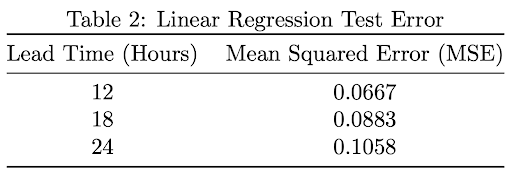
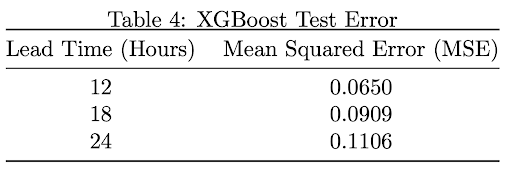
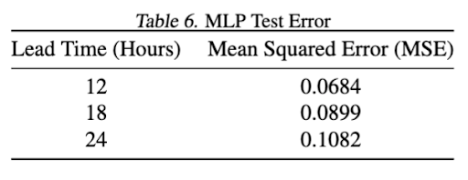

# wave-forecaster

Code for our modeling efforts can be found in the following two notebooks:
- mlp.ipynb
- reg-boost-lstm.ipynb

Code related to data preprocessing is located in the src folder.

We did some data exploration of our features in the data_exploration.ipynb. Unfortunately, we did not have room to include it within the 5 page limit, but it is available in this repository.

Lastly, raw data from the buoys can be found in our data folder. The text files were downloaded from [here](https://www.ndbc.noaa.gov/).

---

## Poster Session Updates

For the final poster, we used the extra time to run inference on the test sets for all four model types we experimented with. Here are the final results (which can also be found in the final poster linked below).

### Linear Regression

### XGBoost

### Multi-layer perceptron

### LSTM

